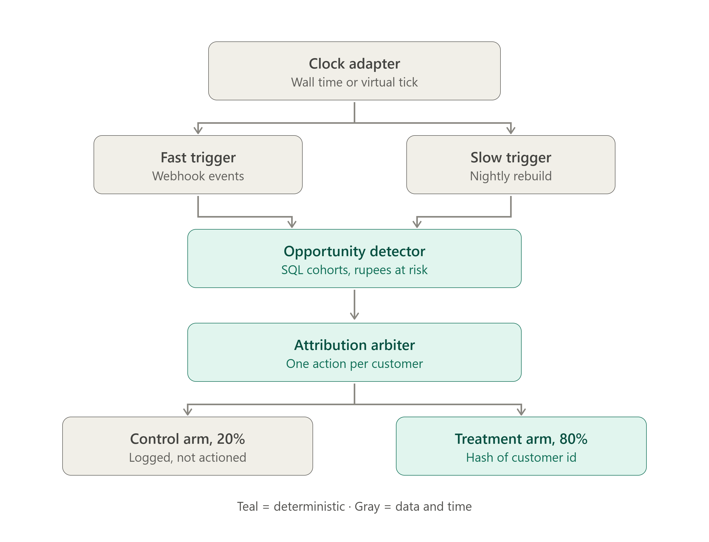
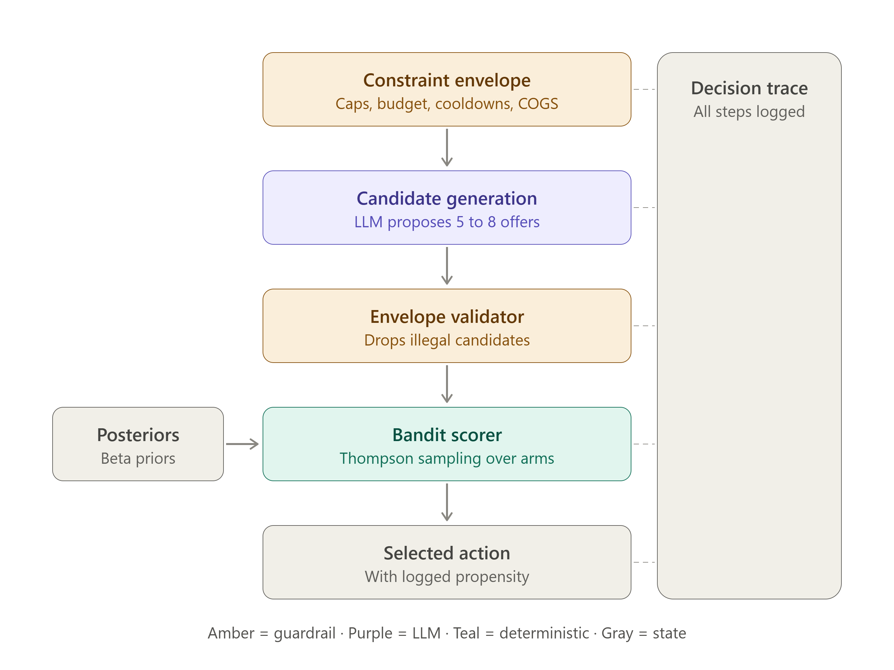
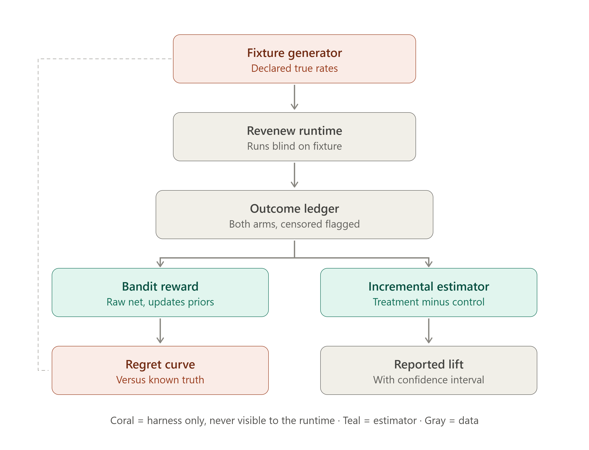

# Revenew

**A decision layer above Razorpay that finds where a merchant's revenue is leaking, takes one bounded commercial action, and proves whether it worked.**

Razorpay AI Buildathon · Track 01, AI Growth & Agentic Commerce

---

## The problem

Merchants lose revenue continuously and quietly. Customers lapse after three orders and never come back. First-time buyers never return. Complementary products sit in the same basket a third of the time and are never bundled. None of this shows up as a failed payment, so nothing alerts anyone.

The tooling that exists for this fails in one of two ways:

- **Rules engines** fire the same offer at everyone forever. They never find out whether the offer worked, so they never improve, and they quietly train customers to wait for discounts.
- **AI marketing assistants** generate plausible campaign copy from a prompt. They have no access to what actually happened afterwards, so their suggestions are unfalsifiable.

Both share the same missing piece. The action is taken, the revenue arrives or doesn't, and nobody can say whether the two are connected. Every reported number is gross revenue from customers who were targeted — most of whom would have bought anyway.

## The solution

Revenew closes that loop, and does it inside constraints that make the closure meaningful.

**Detection is deterministic.** SQL over transaction history finds cohorts and attaches a rupee figure to each one. No LLM counts, joins, or estimates anything. Every opportunity carries the hash of the query that produced it.

**The LLM does one job.** Given a cohort, a catalog, and a hard constraint envelope, it composes 5–8 candidate offers. Composing a specific offer from context is combinatorial with no closed form — that is a real job for a language model. Finding cohorts and ranking outcomes are not.

**Actions are bounded before they are generated.** A constraint envelope — discount caps, remaining budget, excluded SKUs, cooldowns — is injected into the prompt *and* re-applied programmatically to every candidate the model returns. Both use the same rule table, so they cannot drift apart. A model error can produce a suboptimal legal action. It cannot produce an illegal one.

**Selection learns from outcomes.** A Thompson sampling bandit ranks surviving candidates using Beta posteriors per (segment, action family), updated from an append-only outcome ledger. Discount-bearing families start with pessimistic priors so the cold-start policy doesn't burn margin on customers who were going to convert anyway.

**Impact is measured against a holdout.** 20% of eligible customers are assigned to control by deterministic hash. Their opportunities are detected and logged but never actioned. That logged-and-ignored record is the counterfactual, and the only number reported externally is the difference between arms, with a confidence interval.

**Learning itself is verifiable.** The evaluation harness declares true response rates in a separate database the runtime cannot open. The system runs blind against a fixture generated from those rates, and we report cumulative regret against an oracle plus posterior recovery error. Not "the agent learns" — a measured convergence curve against a known answer.

## Features

| | |
|---|---|
| **Deterministic opportunity detection** | Named SQL per opportunity type, each result carrying rupees at risk and a reproducible query hash |
| **Attribution arbiter** | One action per customer per window, enforced by a database unique constraint, not by application code |
| **Constraint envelope** | Enforced twice from a single rule table — once as prompt context, once as a programmatic validator |
| **Contextual bandit** | Thompson sampling with a two-part reward model: Beta for conversion, running moments for revenue magnitude |
| **Append-only outcome ledger** | Update and delete triggers abort. Monotonic sequence makes posteriors exactly reconstructible from the log |
| **Holdout measurement** | 20% control arm, deterministic bucketing, incremental lift per segment with a Welch interval |
| **Virtual clock** | The same code path replays 30 days in ~40 seconds. Reproducible runs, testable time, demoable learning |
| **Decision traces** | Envelope, raw candidates, per-candidate validator verdicts, posterior samples, chosen propensity — every decision, end to end |
| **Explicit failure handling** | Eleven named failure modes with defined responses; the no-action reason distribution is a queryable view |
| **Double-entry budget ledger** | Reserve on decision, commit on execution, release on failure. A crash holds budget rather than losing it |

## Architecture

### Ingestion and routing

Two clocks feed one deterministic detector. Collisions are resolved before bucketing, so a customer can never land in control for one opportunity and treatment for another.

### Decision path

The envelope appears twice on purpose: as context the model is steered by, and as a check the model cannot talk its way past. The bandit sits *after* validation, so it cannot learn its way into a policy violation.

### Measurement harness

Ground truth reaches the regret calculation without ever touching the runtime. Everything coral is test-only scaffolding; the runtime process opens `revenew.db` and nothing else.

## Technical stack

| Layer | Choice | Why |
|---|---|---|
| Language | Python 3.11 | Statistics, SQL, and the LLM SDK in one process |
| Storage | SQLite (WAL) | System state is one diffable, copyable file — replay and reproducibility come free |
| API | FastAPI + uvicorn | Webhook receiver, read API, and demo page from a single server |
| Schemas | Pydantic v2 | One contract for the API and for LLM structured output |
| Scheduling | APScheduler, in-process | One recurring job; a broker would be pure overhead |
| LLM | Claude, one call per decision | Candidate composition only |
| Sampling | Seeded `numpy.random.Generator` | A seeded RNG is what makes replay exact |
| Statistics | SciPy | Welch intervals on the reported lift |
| Dashboard | Jinja2 + Chart.js | No separate frontend build |
| Testing | pytest | Replay equality, envelope invariant, budget conservation |

### Deliberately not used

| | |
|---|---|
| **Kafka / RabbitMQ** | An append-only table with a monotonic sequence already provides ordering and replay. A broker adds an operational dependency and no capability. |
| **Redis** | Nothing is hot. The posterior table is under 100 rows. |
| **Celery** | One nightly job. APScheduler is three lines. |
| **Postgres** | Single writer, single node, under 1 GB. SQLite's file-level portability is a feature for a system whose core claim is exact replay. |
| **LangChain / agent frameworks** | One LLM call with a fixed schema. An agent loop would add nondeterminism to a system built on reproducibility. |
| **Vector DB / RAG** | No corpus. Merchant state is structured and fits in a prompt. |
| **LLM for detection or ranking** | Counting and joining is what SQL is for; ranking is where evidence should decide, not priors. An LLM would be slower, unauditable, and arithmetically unreliable at both. |

---

Full design rationale, failure-mode table, scale analysis, and assumption ledger: [`SYSTEM_DESIGN.md`](SYSTEM_DESIGN.md)